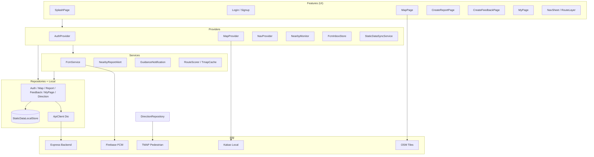

# 공공 안전 지도 (Flutter App)

공공데이터로는 알 수 없는 체감 안전도를, 실시간 제보와 평가로 채운 치안 정보 지도 서비스입니다.


## 개요 Description

앱에서는 공공 치안과 관련된 인프라 위치들을 지도에서 확인할 수 있으며  
각 구역(격자 단위)에 피드백을 남길 수 있으며 실시간으로 발생한 상황을 제보할 수 있습니다.

웹(`public_safety_map_web`)과 동일 백엔드를 사용하는 Flutter 모바일 클라이언트입니다.  
지도는 **OpenStreetMap + flutter_map** 기준이며, 격자·인프라는 로컬 SQLite에 동기화하고 제보·행사는 API로 조회합니다.

## 데모 DEMO

[APK 다운로드 링크]()

테스트 가능 아이디

| | |
|---|---|
| id | `test1` |
| pw | `1234` |

## 주요 기능 Main Feature

- 격자 기반 안전지도 열람 (인프라 · 도시행사 · 사고다발 구간)
- 실시간 제보 등록 (사진 업로드 포함)
- 격자 단위 체감 안전 피드백 남기기
- 내가 올린 제보·피드백 확인 · 수정 · 삭제 (로그인 시)
- 400m 거리 내 긴급 제보 알림 수신 (FCM + GPS 주변 감시)
- CCTV 등 인프라를 고려한 보행 안전 경로 길찾기 (TMAP)

## 실행 방법 Getting Started

### 요구 사항

- Flutter SDK (프로젝트 SDK: `^3.12.2`)
- Android Studio / Android SDK (실기기 또는 에뮬레이터)
- 백엔드 API 서버 (기본값: `Env.apiBaseUrl`)

### 의존성 설치

```bash
flutter pub get
```

### 실행

```bash
# Android 에뮬레이터 / 실기기 (기본 API URL 사용)
flutter run

# API 주소 지정
flutter run --dart-define=API_BASE_URL=https://your-api-host

# 실기기 + 로컬 BE (PC LAN IP)
flutter run --dart-define=API_BASE_URL=http://192.168.x.x:4100
```

### APK 빌드 (스토어 없이 배포)

```bash
flutter build apk --release
```

결과물: `build/app/outputs/flutter-apk/app-release.apk`

ABI별 분할:

```bash
flutter build apk --release --split-per-abi
```

### Firebase 알림 (FCM) 설정

푸시 알림을 쓰려면 Firebase 프로젝트와 앱 설정이 필요합니다.

1. [Firebase Console](https://console.firebase.google.com/)에서 프로젝트 생성 후 Android 앱 등록  
   - 패키지명: `com.publicsafetymap.public_safety_map_app`
2. `google-services.json` 다운로드 → `android/app/google-services.json` 에 배치
3. FlutterFire CLI로 Dart 옵션 생성:

```bash
dart pub global activate flutterfire_cli
flutterfire configure
```

4. 생성 파일
   - `lib/firebase_options.dart` (보통 gitignore — 로컬에서 생성)
   - `android/app/google-services.json`
5. 앱에서 **알림 권한** 허용 (마이페이지 알림 설정 / 지도 주변감시 ON 시 안내)
6. 로그인 후 FCM 토큰이 백엔드 `/notification/register` 로 등록됩니다.

> `lib/firebase_options.dart` · `google-services.json` 은 저장소에 올리지 않는 것을 권장합니다.  
> 팀원은 각자 Firebase에서 내려받아 로컬에 두면 됩니다.

## 기술 스택 Stack

| 구분 | 기술 |
|---|---|
| Framework | Flutter (Dart) |
| 상태 관리 | Provider (`ChangeNotifier`) |
| 라우팅 | go_router |
| HTTP | Dio (+ CookieJar, SecureStorage) |
| 지도 | flutter_map + OpenStreetMap |
| 위치 | geolocator |
| 로컬 DB | sqflite (격자·인프라 정적 데이터) |
| 푸시 | Firebase Cloud Messaging + flutter_local_notifications |
| 경로 | TMAP 보행자 API (앱 직접 호출) |
| 장소/행정 | Kakao Local REST |
| 백엔드 | Express API (웹과 공유) |

## 프로젝트 구조 Project Structure

`lib/` 기준입니다.

```
lib/
├── main.dart                 # DI · MultiProvider · GoRouter · Firebase 초기화
├── firebase_options.dart     # FlutterFire 생성 (로컬)
├── core/
│   ├── config/               # Env, media URL
│   ├── network/              # ApiClient, 예외, 사용자 메시지
│   ├── geo/                  # 좌표·행정 유틸
│   ├── theme/                # 앱 테마
│   └── format/               # 행사 등 텍스트 포맷
├── data/
│   ├── models/               # DTO · MapFocusTarget 등
│   ├── repositories/         # Auth, Map, Report, Feedback, MyPage, Direction
│   └── local/                # StaticDataLocalStore (sqflite)
├── providers/
│   ├── auth_provider.dart
│   ├── map_provider.dart
│   ├── nav_provider.dart
│   └── fcm_inbox_store.dart  # 앱 내 알림 목록
├── services/
│   ├── fcm_service.dart              # FCM 수신 · 로컬 배너
│   ├── nearby_monitor.dart           # 백그라운드 400m 감시 ON/OFF
│   ├── nearby_report_alert.dart      # 근접 제보·다발 알림
│   ├── static_data_sync_service.dart # 격자/인프라 버전 동기화
│   ├── device_notification_permission.dart
│   └── (경로) route_scorer, tmap_route_cache, guidance_* …
├── features/
│   ├── splash/
│   ├── auth/                 # 로그인 · 회원가입
│   ├── map/                  # 지도 메인
│   ├── report/               # 제보 작성
│   ├── feedback/             # 피드백 작성
│   ├── mypage/               # 내 제보·피드백·알림·설정
│   └── nav/                  # 길찾기 시트 · 경로 레이어
└── widgets/                  # 마커 · 미디어 · 인프라 클러스터
```

## 아키텍처 구조도 Architecture



**데이터 흐름 요약**

| 데이터 | 저장 / 조회 |
|---|---|
| 격자 · 인프라 | `/sync` 버전 확인 후 SQLite 덤프 · bbox는 로컬 우선 |
| 제보 · 행사 | MapProvider 메모리 + API (반경 캐시) |
| FCM 제보 | 임시 마커 persist · 400m 안이면 알림함 + 로컬 배너 |
| 보행 경로 | TMAP 직접 호출 (BE 프록시 없음) |

**알림**

- **FCM**: 서버 푸시 → 지도 마커 · (근접 시) 배너/알림함  
- **NearbyMonitor**: GPS 기반 400m 감시 → Foreground Service 알림 + 로컬 알림  
- 시스템 알림 권한이 꺼져 있으면 주변감시·알림 설정을 ON 할 수 없음 (설정 안내)
